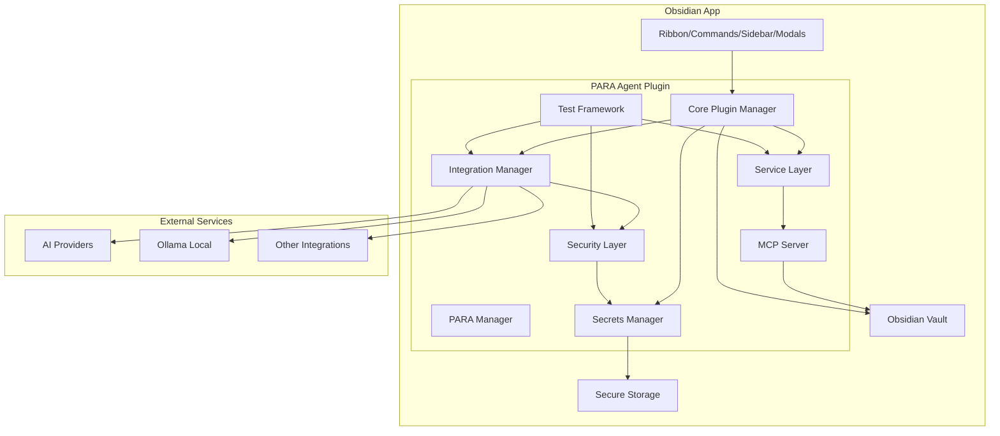

# PARA Method Obsidian Agent - Overall Plan

## Overview

This document outlines the complete plan for building a testable Obsidian plugin with a click-based UI, MCP file search integration, and support for multiple integrations (AI providers, external services) to automate PARA method tasks.

## Architecture Overview

The plugin will be built as a TypeScript-based Obsidian plugin with a testable, modular architecture supporting multiple UI interaction points, MCP integration, and extensible integration system.



## Project Structure

```
second-brain-agent/
├── plugin/                    # Obsidian plugin source
│   ├── src/
│   │   ├── main.ts           # Plugin entry point
│   │   ├── core/
│   │   │   ├── PARA.ts       # PARA method logic
│   │   │   └── PluginManager.ts
│   │   ├── services/
│   │   │   ├── FileService.ts
│   │   │   ├── TagService.ts
│   │   │   ├── LinkService.ts
│   │   │   ├── TemplateService.ts
│   │   │   ├── SearchService.ts
│   │   │   ├── AIService.ts
│   │   │   ├── ProjectService.ts
│   │   │   ├── AreasService.ts
│   │   │   ├── PropertiesService.ts
│   │   │   └── MOCService.ts
│   │   ├── integrations/
│   │   │   ├── IntegrationManager.ts
│   │   │   ├── AIProviderManager.ts
│   │   │   ├── LocalLLMService.ts
│   │   │   ├── PromptService.ts
│   │   │   ├── MCPFileSearchService.ts
│   │   │   ├── SecretsManager.ts
│   │   │   └── integrations/
│   │   │       ├── OpenAIIntegration.ts
│   │   │       ├── AnthropicIntegration.ts
│   │   │       ├── OllamaIntegration.ts
│   │   │       └── BaseIntegration.ts
│   │   ├── security/
│   │   │   ├── EncryptionService.ts
│   │   │   └── SecureStorage.ts
│   │   ├── mcp/
│   │   │   ├── MCPServer.ts
│   │   │   ├── FileSearchTool.ts
│   │   │   └── VaultContextTool.ts
│   │   ├── ui/
│   │   │   ├── SidebarView.ts
│   │   │   ├── Modals.ts
│   │   │   └── Components.ts
│   │   └── utils/
│   │       └── helpers.ts
│   ├── tests/
│   │   ├── unit/
│   │   │   ├── services/
│   │   │   ├── integrations/
│   │   │   └── mcp/
│   │   ├── integration/
│   │   │   └── e2e/
│   │   ├── mocks/
│   │   │   ├── ObsidianMocks.ts
│   │   │   └── VaultMocks.ts
│   │   └── setup.ts
│   ├── styles.css
│   ├── manifest.json
│   └── package.json
├── docs/                      # Documentation
├── .github/
│   └── workflows/
│       └── ci.yml            # CI/CD pipeline
├── .gitignore
├── package.json              # Root package.json for monorepo
└── README.md
```

## Core Features

### 1. PARA Method Structure
- **Projects**: Active work with deadlines
- **Areas**: Ongoing responsibilities
- **Resources**: Topics of interest
- **Archives**: Inactive items

### 2. File Organization Service
- Auto-detect and move files to appropriate PARA folders
- Support custom folder structure configuration
- Batch operations for multiple files
- Undo/redo capability
- Property-based organization (via PropertiesService)

### 3. Tag Management Service
- Apply PARA tags (#project, #area, #resource, #archive)
- Status tags (#active, #on-hold, #completed)
- Auto-tag based on folder location
- Tag-based filtering
- AI-powered tag suggestions

### 4. Project Tracking Service
- Track project status
- **Project Limit Enforcement**: Maximum 3 active personal projects (configurable)
- **EADPC Prioritization**: Integrate Eliminate, Automate, Delegate, Procrastinate, Concentrate workflow
- **Deadline Management**: Enforce deadlines, reminders, and tracking
- Auto-archive completed projects
- Project metadata (deadlines, status, priority)
- Project dashboard view
- **Golden Circle Integration**: Track Why, How, What for motivation

### 5. Link Management Service
- Auto-create links between related PARA items
- Link suggestions based on content
- Visualize PARA relationships
- Broken link detection
- Bidirectional linking

### 6. Template Service
- PARA-specific note templates
- **Project Plan Template**: Based on Golden Circle Model (Why, How, What) + EADPC
  - Why am I doing this?
  - How will I do this?
  - What am I doing?
  - Scope
  - What does complete look like?
  - Tasks
  - Deadline
- **Plan of Action Template**: For Areas of Improvement
  - Why am I doing this?
  - How will I do this?
  - What am I doing?
  - Initiatives
  - Projects
- Quick note creation from templates
- Template variables (date, project name, etc.)
- Custom template support

### 7. Search & Filter Service
- Filter by PARA category
- Filter by status/tags
- Advanced search with PARA context
- Saved search queries

### 8. AI Service
- Extract information from project notes using AI
- Distribute extracted information to relevant resources
- Generate insights from second brain content only (no external data)
- AI-assisted project archiving
- Content analysis and summarization

### 9. Project Archive Service
- Archive current project with one-click action
- AI-assisted cleanup and information extraction before archiving
- Preserve important information to resources
- Update project status and move to Archives folder
- Generate archive summary

### 10. Areas of Improvement Management
- Track areas of improvement as a special category (uses "Areas of Improvement" terminology)
- **Initiative Tracking**: Separate tracking of initiatives from projects
- **Plan of Action Template**: Structured template for each Area of Improvement
- **Project Linking**: Link related projects to Areas of Improvement
- AI-powered suggestions for improvement areas
- Link improvements to related projects and resources
- Progress tracking and metrics
- Regular review and update workflows
- **Golden Circle Integration**: Track Why, How, What for each area

### 11. Properties Service
- Manage PARA metadata via frontmatter properties
- Support Obsidian's "Bases" plugin integration
- Database-like filtering and grouping
- Properties: `para-type`, `status`, `deadline`, `priority`, `area-of-improvement`

### 12. MOC Service
- Generate Maps of Content for PARA categories
- Auto-update MOC indices
- Link management via MOCs

### 13. Secrets Management Service
- Encrypted storage for API keys (OpenAI, Anthropic, etc.)
- Use Electron's safeStorage API for secure storage
- Cross-platform support (Keychain on macOS, Windows Credential Store, Linux keyring)
- Separate secrets file outside data.json
- Masked input fields in settings UI
- Key rotation and validation
- Never store keys in plain text or code

### 14. Ollama Auto-Detection
- Automatic detection of running Ollama instance
- Check for Ollama service on default port (11434)
- Health check and availability verification
- List available models from local Ollama instance
- User consent and control for local processing
- Secure API communication with local Ollama
- Graceful fallback when Ollama unavailable

## Testing Strategy

### Testable Architecture

**Design Principles:**
- Dependency Injection for all services
- Interface-based abstractions
- Mock-friendly architecture
- Separation of concerns

**Testing Framework:**
- **Unit Tests**: Jest + TypeScript
- **Integration Tests**: Jest with Obsidian API mocks
- **E2E Tests**: Playwright or similar for UI testing
- **Coverage**: Minimum 80% code coverage

**Key Testing Areas:**
1. **Service Layer**: All services must be unit testable with mocks
2. **Integration Layer**: Test integration manager and providers
3. **MCP Layer**: Test MCP server and file search tools
4. **UI Components**: Test UI interactions and state management
5. **PARA Logic**: Test core PARA method operations
6. **Security**: Test encryption and secrets management

**CI/CD Integration:**
- Run tests on every commit
- Enforce coverage thresholds
- Run tests on multiple Node.js versions
- Automated release on version tags

## MCP Integration

### MCP File Search Service

**Purpose**: Enable AI assistants to search and access Obsidian vault files via Model Context Protocol.

**Features:**
- Semantic file search across vault
- PARA-aware search (filter by category)
- Content retrieval for AI context
- Secure access control
- Search result ranking

**MCP Tools:**
1. `search_files`: Search files by query, PARA category, tags
2. `get_file_content`: Retrieve file content for AI processing
3. `get_vault_context`: Get vault structure and PARA organization
4. `search_by_para_type`: Search within specific PARA category

## Security & Secrets Management

### Encrypted Secrets Storage

**Security Features:**
- **Electron safeStorage API**: Uses OS-level secure storage
  - macOS: Keychain
  - Windows: Windows Credential Store
  - Linux: libsecret/keyring
- **Separate Secrets File**: Stored outside data.json, excluded from Git
- **Encryption at Rest**: All API keys encrypted before storage
- **Masked UI Input**: Password-style input fields in settings
- **Key Validation**: Validate keys before storage
- **Key Rotation**: Support for rotating expired keys
- **Never in Plain Text**: Keys never stored or logged in plain text

### Ollama Auto-Detection

**Features:**
- **Automatic Detection**: Scans for running Ollama instance
- **Health Check**: Verifies Ollama availability on default port (11434)
- **Model Discovery**: Lists available models from local instance
- **User Consent**: Explicit permission before using local Ollama
- **Secure Communication**: Secure API calls to local instance
- **Graceful Fallback**: Handles unavailable Ollama gracefully

## Multiple Integrations Support

### Integration Manager

**Architecture:**
- Plugin-based integration system
- Base integration interface
- Registration and discovery mechanism
- Configuration per integration

**Supported Integration Types:**

1. **AI Providers**
   - OpenAI (GPT-3.5, GPT-4)
   - Anthropic (Claude)
   - Local LLMs (Ollama, LM Studio)
   - Custom AI providers

2. **External Services** (Extensible)
   - Calendar services
   - Task management (Todoist, Asana)
   - Note synchronization
   - Cloud storage
   - Custom integrations

**Integration Manager Features:**
- Dynamic loading of integrations
- Configuration management per integration
- Health checks and error handling
- Integration marketplace/discovery
- Enable/disable integrations
- Secure credential management via SecretsManager

## UI Components

### Ribbon Commands
- Quick actions: "Move to Project", "Move to Archive", "Create Project Note", "Archive Current Project", "Extract to Resources"
- Icon-based buttons in Obsidian ribbon

### Command Palette
- All plugin commands accessible via Cmd/Ctrl+P
- Searchable command list

### Sidebar Panel
- PARA dashboard showing:
  - Active projects count
  - Areas overview
  - Recent resources
  - Quick actions panel
  - Integration status
  - Collapsible sections

### Modal Dialogs
- File organization wizard
- Project creation form
- Tag management interface
- Template selection dialog
- Search/filter interface
- AI extraction wizard
- Archive project confirmation
- Areas of improvement management interface
- Insight generation dialog
- Integration configuration dialog

## Technology Stack

- **Language**: TypeScript
- **Framework**: Obsidian Plugin API
- **Build Tool**: esbuild (via Obsidian plugin template)
- **UI**: Obsidian's built-in UI components + custom CSS
- **Testing**: Jest, @types/jest, ts-jest
- **MCP**: Model Context Protocol implementation
- **CI/CD**: GitHub Actions

## Development Workflow

1. Initialize Obsidian plugin structure
2. Set up TypeScript configuration
3. Set up testing framework (Jest)
4. Create mock infrastructure
5. Implement core PARA logic (with tests)
6. Build service layer (with tests)
7. Implement secrets management system
8. Implement integration system with secure credential storage
9. Implement Ollama auto-detection
10. Implement MCP server and tools
11. Create UI components (with tests)
12. Integrate all components
13. Add settings/configuration with encrypted key management
14. Write integration and E2E tests
15. Set up CI/CD pipeline
16. Security audit and testing
17. Testing and refinement

## Personal PARA Setup Integration

Based on the personal implementation documented in [PERSONAL_PARA_SETUP.md](PERSONAL_PARA_SETUP.md), the plugin incorporates:

### Key Features
- **Project Plan Template**: Golden Circle Model (Why, How, What) + EADPC framework
- **Plan of Action Template**: For Areas of Improvement with Initiatives and Projects tracking
- **Project Limit**: Maximum 3 active personal projects (configurable)
- **Deadline Enforcement**: Required deadlines with reminders
- **Initiative Tracking**: Separate from projects in Areas of Improvement
- **EADPC Workflow**: Prioritization framework integration
- **Scope Definition**: Clear scope and "complete" criteria for projects

### Templates
- Default templates match the personal setup
- Customizable to user preferences
- AI-assisted template filling

## Future Extensibility

The architecture supports adding:
- Additional tasks and workflows
- Custom PARA workflows
- New integration types
- Additional MCP tools
- Custom test utilities
- Performance monitoring
- Additional prioritization frameworks
- Custom template variations
- Analytics and reporting

## Implementation Status

See the project's issue tracker and pull requests for current implementation status and progress.

## Contributing

This is an open-source project. Contributions are welcome! Please see the [Contributing Guide](CONTRIBUTING.md) for details.

## License

MIT License - see [LICENSE](LICENSE) file for details.

