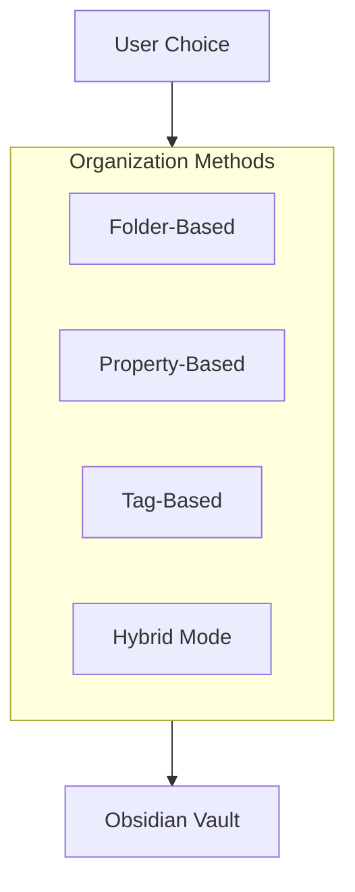

# Plan Validation & Improvements (January 2026)

## Validation Summary

The PARA Method Obsidian Agent plan has been validated against current market best practices and 2026 Obsidian plugin development standards. This document outlines key findings and recommended improvements.

## Key Validations

### ✅ Technology Stack - CONFIRMED APPROPRIATE
- **TypeScript + Obsidian Plugin API**: Standard and recommended approach
- **esbuild**: Remains the recommended build tool for Obsidian plugins
- **Service Layer Architecture**: Aligns with modern plugin patterns (similar to Deep Ask, AI Assistant plugins)

### ✅ AI Integration - ENHANCED RECOMMENDATIONS
- **Multi-Provider Support**: Essential in 2026 (OpenAI, Anthropic, local LLMs)
- **Local LLM Priority**: Ollama, LM Studio support should be prioritized for privacy
- **Modular Architecture**: Abstract provider layer for easy switching

### ⚠️ PARA Method Implementation - IMPORTANT CONSIDERATIONS

**Critical Finding**: Current best practices suggest avoiding rigid folder-only organization in Obsidian.

**Recommended Approach**:
1. **Hybrid Organization**: Combine folder structure with properties/tags
2. **Properties as Database**: Leverage Obsidian's "Bases" core plugin
3. **Tag-Based Flexibility**: Use tags for cross-category connections
4. **Backlinks**: Emphasize Obsidian's native linking capabilities

## Critical Improvements to Add

### 1. Properties/Frontmatter as Database (HIGH PRIORITY)

**Why**: Obsidian's "Bases" plugin treats notes as database entries using frontmatter properties. This is more flexible than folders alone.

**Add to Plan**:
- **PropertiesService.ts**: Manage PARA metadata via frontmatter
  - Properties: `para-type`, `status`, `deadline`, `priority`, `area-of-improvement`
  - Support database-like filtering and grouping
- **Hybrid Organization Mode**: Allow users to choose:
  - Folder-based (traditional PARA)
  - Property-based (database approach)
  - Hybrid (both)

**Implementation Files**:
- `plugin/src/services/PropertiesService.ts` - New service
- Update `FileService.ts` to support property-based organization
- Add settings for organization mode selection

### 2. Enhanced AI Service Architecture

**Current Gap**: Plan mentions AI service but lacks provider abstraction.

**Add**:
- **AIProviderManager.ts**: Abstract interface for multiple providers
  - Support OpenAI, Anthropic, local LLMs (Ollama, LM Studio)
  - Provider switching without code changes
- **LocalLLMService.ts**: Dedicated service for local models
  - Privacy-first approach
  - Offline capability
- **PromptService.ts**: Context-aware prompt generation
  - Use only vault content (no external data)
  - Maintain context across operations

**Implementation Files**:
- `plugin/src/services/AIProviderManager.ts` - New
- `plugin/src/services/LocalLLMService.ts` - New
- `plugin/src/services/PromptService.ts` - New
- Update `AIService.ts` to use provider manager

### 3. Tag & Link Strategy Enhancement

**Improvements**:
- **Auto-tagging**: More intelligent tag suggestions based on content
- **Backlink Generation**: Auto-create bidirectional links between related PARA items
- **MOCs (Maps of Content)**: Generate index notes for each PARA category
- **Graph View Integration**: PARA-specific visualizations in Obsidian's graph view

**Implementation**:
- Enhance `TagService.ts` with AI-powered suggestions
- Enhance `LinkService.ts` with bidirectional linking
- Add `MOCService.ts` for Maps of Content generation

### 4. User Experience Enhancements

**Add**:
- **Organization Mode Selector**: Settings to choose folder/property/hybrid
- **Visual Indicators**: PARA category badges in file explorer
- **Keyboard Shortcuts**: Quick actions via hotkeys
- **Undo/Redo Stack**: For all operations (not just file moves)
- **Progress Indicators**: For AI operations (streaming, progress bars)
- **Error Handling**: Graceful degradation when AI unavailable

### 5. Integration with Obsidian Core Features

**Leverage Native Features**:
- **Bases Plugin**: Database functionality via properties
- **Graph View**: PARA relationship visualization
- **Daily Notes**: Integration for project tracking
- **Calendar Plugin**: Deadline management
- **Search**: Enhanced PARA-aware search filters

## Updated Architecture

### Enhanced Service Layer

```
services/
├── FileService.ts          # File operations (folders)
├── PropertiesService.ts    # NEW: Property-based organization
├── TagService.ts           # Enhanced with AI suggestions
├── LinkService.ts          # Enhanced with bidirectional links
├── MOCService.ts           # NEW: Maps of Content generation
├── AIService.ts            # Main AI interface
├── AIProviderManager.ts    # NEW: Multi-provider abstraction
├── LocalLLMService.ts      # NEW: Local LLM support
├── PromptService.ts        # NEW: Context-aware prompts
└── ...
```

### Organization Strategy



## Additional Todos to Add

1. **properties-service**: Create PropertiesService.ts for frontmatter-based PARA organization
2. **ai-provider-manager**: Build AIProviderManager.ts for multi-provider support
3. **local-llm-support**: Implement LocalLLMService.ts for Ollama/LM Studio integration
4. **hybrid-organization**: Add settings for folder/property/hybrid organization modes
5. **moc-support**: Implement Maps of Content generation for PARA categories
6. **graph-enhancements**: Add PARA-specific graph view visualizations
7. **prompt-service**: Create PromptService.ts for context-aware AI prompts
8. **undo-redo-stack**: Implement comprehensive undo/redo for all operations

## Market Validation Results

### ✅ Confirmed Best Practices
- Service layer architecture matches successful plugins (Deep Ask, AI Assistant, File Organizer 2000)
- AI integration patterns align with 2026 standards
- Multi-provider support is essential
- Properties-based organization is gaining traction

### ⚠️ Areas Requiring Adjustment
- **Folder-only approach**: Too rigid for Obsidian's strengths
- **Single AI provider**: Need abstraction layer
- **Missing local LLM support**: Privacy concern
- **Limited Obsidian integration**: Should leverage more native features

## Recommended Priority Order

### Phase 1 (Core Functionality)
1. PropertiesService implementation
2. Hybrid organization mode
3. Enhanced TagService with AI suggestions

### Phase 2 (AI Enhancement)
1. AIProviderManager
2. LocalLLMService
3. PromptService

### Phase 3 (UX Improvements)
1. MOC generation
2. Graph view enhancements
3. Keyboard shortcuts
4. Comprehensive undo/redo

## References

Based on research from:
- Obsidian community forums (2026)
- Deep Ask plugin architecture
- AI Assistant plugin patterns
- File Organizer 2000 plugin
- Obsidian Bases plugin documentation
- PARA method best practices in Obsidian

## Conclusion

The original plan is solid but should be enhanced with:
1. **Properties-based organization** (high priority)
2. **Multi-provider AI architecture** (high priority)
3. **Local LLM support** (privacy priority)
4. **Hybrid organization modes** (flexibility priority)

These improvements align the plan with 2026 best practices and Obsidian's strengths as a knowledge management platform.

