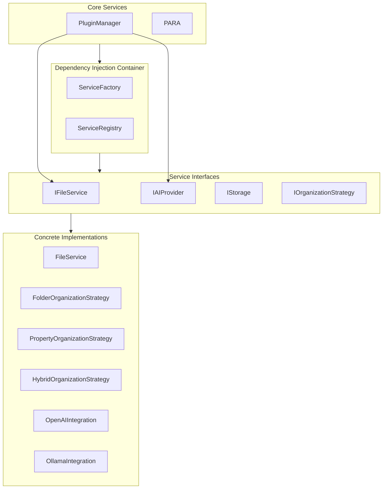

# Architecture Documentation

## Overview

The PARA Method Obsidian Agent uses an abstraction layer architecture with dependency injection to enable swappable implementations and improve testability.

## System Architecture

## Abstraction Layer Design

### Interface-Based Design

All services are abstracted behind interfaces, enabling:
- Easy swapping of implementations
- Mock implementations for testing
- Clear contracts between components
- Plugin-style extensibility

### Service Interfaces

- **IFileService**: File operations abstraction
- **IPropertiesService**: Property management abstraction
- **ITagService**: Tag operations abstraction
- **ILinkService**: Link management abstraction
- **ISearchService**: Search operations abstraction
- **ITemplateService**: Template operations abstraction
- **IProjectService**: Project management abstraction
- **IAreasService**: Areas management abstraction
- **IAIService**: AI operations abstraction
- **IAIProvider**: AI provider abstraction
- **IStorage**: Storage abstraction
- **IOrganizationStrategy**: Organization mode abstraction

## Dependency Injection System

### ServiceContainer

The `ServiceContainer` manages service lifecycle and dependency resolution:

- **Service Registration**: Register interfaces with implementations
- **Dependency Resolution**: Automatically resolve dependencies
- **Lifecycle Management**: Singleton, transient, and scoped services

### ServiceFactory

The `ServiceFactory` creates services with proper dependencies:

- **Create Services**: Instantiate services with injected dependencies
- **Configuration**: Apply settings to services
- **Lazy Loading**: Load services on demand

## Strategy Pattern Implementation

Organization strategies implement `IOrganizationStrategy`:

- **FolderOrganizationStrategy**: Folder-based organization
- **PropertyOrganizationStrategy**: Property-based organization
- **HybridOrganizationStrategy**: Hybrid organization

The `OrganizationStrategyFactory` creates strategies based on organization mode.

## Integration System

### BaseIntegration

All integrations extend `BaseIntegration`:

- **Health Checks**: Verify integration availability
- **Lifecycle Management**: Initialize and cleanup
- **Configuration**: Manage integration settings

### AI Providers

AI providers implement `IAIProvider`:

- **OpenAIIntegration**: OpenAI API integration
- **AnthropicIntegration**: Anthropic API integration
- **OllamaIntegration**: Local Ollama integration

## Data Flow

### Service Resolution Flow

1. PluginManager requests service from container
2. Container checks if service is registered
3. Container resolves dependencies recursively
4. Container creates service instance
5. Service is returned to PluginManager

### Request Flow

1. User action triggers command
2. PluginManager delegates to appropriate service
3. Service uses injected dependencies
4. Service performs operation
5. Result returned to user

## Design Decisions

### Why Dependency Injection?

- **Testability**: Easy to mock dependencies
- **Flexibility**: Swap implementations without code changes
- **Maintainability**: Clear dependencies and contracts
- **Extensibility**: Add new implementations easily

### Why Interface-Based Design?

- **Swappability**: Easy to swap implementations
- **Testability**: Mock interfaces for testing
- **Clarity**: Clear contracts between components
- **Extensibility**: Plugin-style architecture

### Why Strategy Pattern for Organization?

- **Flexibility**: Support multiple organization modes
- **Extensibility**: Easy to add new organization strategies
- **Separation of Concerns**: Organization logic separated from file operations

## Extension Points

### Adding Custom Services

1. Create interface extending base service interface
2. Implement interface in service class
3. Register service in ServiceContainer
4. Resolve service from container

### Adding Custom Integrations

1. Extend BaseIntegration
2. Implement IAIProvider if AI provider
3. Register integration in IntegrationManager
4. Integration automatically available

### Adding Organization Strategies

1. Implement IOrganizationStrategy
2. Add strategy to OrganizationStrategyFactory
3. Strategy available for use

